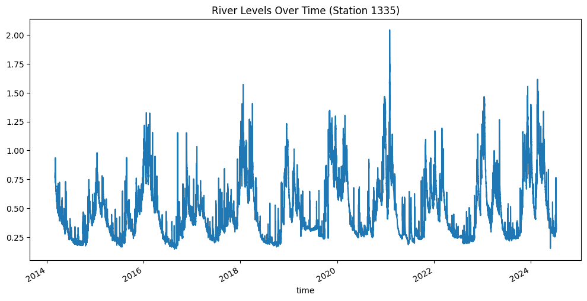
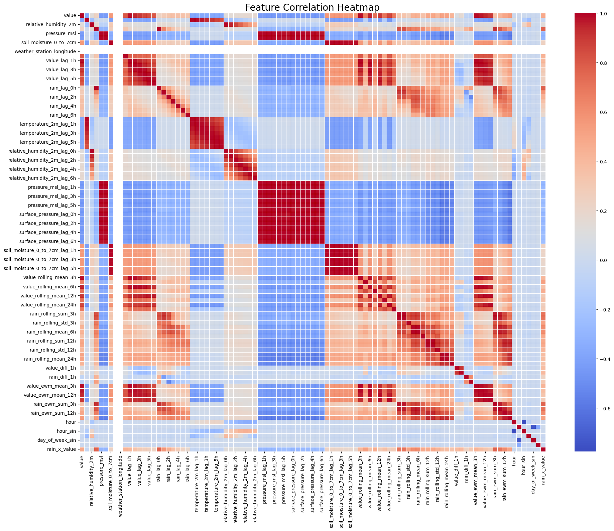
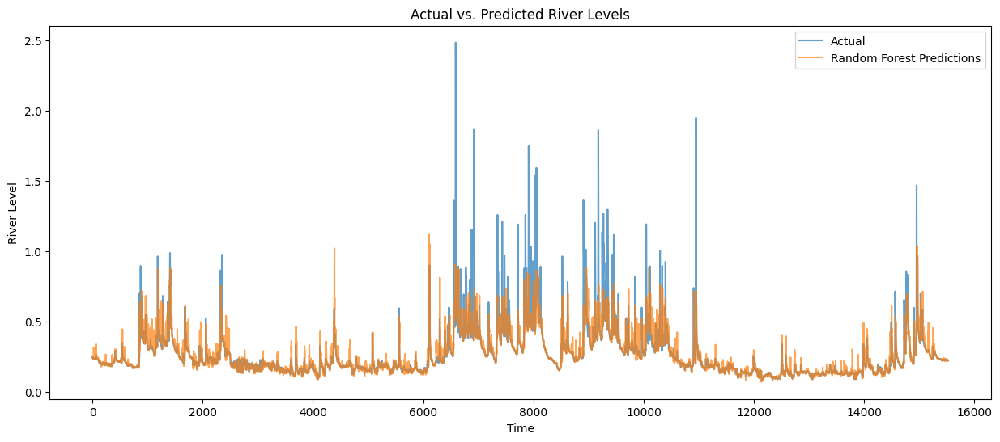

# **Cornwall Flood Prediction Project**  
_Using machine learning to predict river levels in real-time and mitigate flood risks_

  


---


## Project Motivation

Growing up in Spain, I experienced severe flooding firsthand, which displaced my family and left a lasting impact on me. This personal experience sparked my desire to tackle complex real-world problems using data science. Consequently, I embarked on this **Cornwall Flood Prediction Project**, with the goal of learning an end-to-end data science workflow while addressing a challenging **real-world** scenario:

- **End-to-end DS challenge**: data collection, preprocessing, modeling, deployment
- **High complexity**: Flooding is influenced by many factors (weather, topography, hydrology)
- **Social impact**: Accurate flood forecasting can help communities mitigate flood risk
- **Personal learning**: No hydrology background, but leveraging data science skills to tackle a specialized domain

Ultimately, I’m showcasing a full pipeline that **ingests real-time weather forecasts, current/lagged river gauge data, and weather observations** to **predict future river levels**. 

---

## Table of Contents
1. [Project Motivation](#project-motivation)  
2. [Data Sources & Collection](#data-sources--collection)  
3. [Data Exploration & Preprocessing](#data-exploration--preprocessing)  
4. [Feature Engineering & EDA](#feature-engineering--eda)  
5. [Model Development](#model-development)  
   - [Baseline Models](#baseline-models)  
   - [Next Steps in Modeling](#next-steps-in-modeling)  
6. [Repository Structure](#repository-structure)  
7. [Current Status & Roadmap](#current-status--roadmap)  
8. [Contact & Acknowledgments](#contact--acknowledgments)  

---

## Data Sources & Collection

  


1. **Shoothill Gaugemap API**  
   - Programmatically scraped ~2 GB of time-series data for **all Cornwall river gauges**.  
   - Data includes river levels, elevation, river catchment, and gauge metadata.  
   - Learned to reverse-engineer the API structure to automate data collection.

2. **Open-Meteo and Other Weather APIs**  
   - Explored multiple open-source weather APIs before settling on **Open-Meteo** for historical weather data.  
   - Collected hourly weather variables (temperature, rainfall, etc.) to match with river gauge timestamps.  

**Challenge**: Finding **historical weather forecast** data was difficult, so current models rely on observed data (and near-future strategies might integrate forecast data if obtained).

---

## Data Exploration & Preprocessing

### Handling Missing & Erroneous Values
- Discovered extreme outliers and negative readings in the gauge data.  
- Developed a custom script to detect anomalies (spikes >10× standard deviation, negative readings).  
- Initially flagged them as `NaN` until verifying they were valid/invalid.  
- Found that the **Environment Agency** already provided quality labels, so I leveraged their validated dataset instead.  
- **Lesson**: Preprocessing 60 CSVS in bulk can be a major time sink, but it fosters robust data handling / data quality skills.

### Initial Time-Series Analysis
- Used seasonal decompositions, ACF/PCF plots in **statsmodels** to identify trends and seasonality.  
- **Key finding**: Strong annual patterns, but focusing on a **6-hour lead time** reduced the importance of long seasonal cycles.  
- **Time-series EDA** Revealing which variables correlate with river level changes.

---

## Feature Engineering & EDA

  


- Merged hourly river gauge data with weather features into a single DataFrame.  
- Engineered **lagged variables** (e.g., river level 1h ago, 2h ago, …, temperature/rainfall lags).  
- Conducted **feature importance** analysis using Random Forest to identify influential predictors.  
- Performed **VIF (Variance Inflation Factor)** analysis revealing high collinearity among weather variables.  
- Implemented **time-series cross-validation** (sklearn’s `TimeSeriesSplit` and `sktime`) to ensure robust model evaluation.

---

## Model Development

### Baseline Models
1. **ARIMA (AutoRegressive Integrated Moving Average)**:
   - Chosen as primary baseline model for all river gauges
   - Captures temporal dependencies and seasonality in river level data
   - Provides strong univariate forecasting benchmark before adding weather variables
2. **Random Forest Regressor**:  
   - Provided initial non-linear improvements
   - Important for **feature importance** insights (e.g., top features are lagged water levels)
  
### Next Steps in Modeling
1. **Other Tree-Based Models**:  
   - **XGBoost**, **CatBoost** for improved performance and interpretability.  
2. **Prophet**:  
   - Time-series library from Meta specialized in forecasting.  
3. **Neural Networks (Pytorch)**:  
   - **LSTM**, **GRU**, **Transformers** to capture complex temporal patterns.  
   - Potential for a **global model** trained on all gauges vs. local per-gauge models.

**Goal**: Determine whether advanced deep learning architectures can improve flood prediction accuracy beyond traditional regression.

---

## Repository Structure

```bash
flood-prediction/
├── data/               # Data files
├── notebooks/          # Jupyter notebooks for analysis
├── src/               # Source code
│   ├── data/          # Data processing scripts
│   ├── features/      # Feature engineering
│   ├── models/        # ML models
│   └── visualization/ # Plotting utilities
├── tests/             # Unit tests
├── Dockerfile         # Container definition
├── docker-compose.yml # Development setup
└── environment.yml    # Dependencies
```

## Development Setup

### Using Docker (Recommended)

1. Clone the repository:
   ```bash
   git clone https://github.com/your-username/flood-prediction.git
   cd flood-prediction
   ```

2. Start the development environment:
   ```bash
   docker-compose up
   ```

3. Access Jupyter Lab at `http://localhost:8888` (token will be shown in console)

### Local Development

1. Create the conda environment:
   ```bash
   conda env create -f environment.yml
   conda activate waterfall
   ```

2. Set up pre-commit hooks (optional):
   ```bash
   pre-commit install
   ```

## Deployment

### Development
- Use `docker-compose` for local development
- Changes in local files are reflected immediately in the container
- Jupyter Lab available at `localhost:8888`

### Production (Planned)
- CI/CD pipeline with GitHub Actions
- Model serving via FastAPI
- Deployment to cloud platform (AWS/GCP)
- Monitoring with MLflow

## Contributing

1. Fork the repository
2. Create a feature branch
3. Commit your changes
4. Push to the branch
5. Create a Pull Request

## License

This project is licensed under the MIT License - see the LICENSE file for details.

---

## Current Status & Roadmap

- **Current Status**: 🚧 In Progress
- **Roadmap**:
  - Complete model development and evaluation
  - Deploy model to cloud platform
  - Implement monitoring and maintenance

---

## Contact & Acknowledgments

**Author**: Misha  
**Project Status**: 🚧 In Progress  
**Contact**: Connect with me on [LinkedIn](https://www.linkedin.com/in/misha-freidin/)  

---